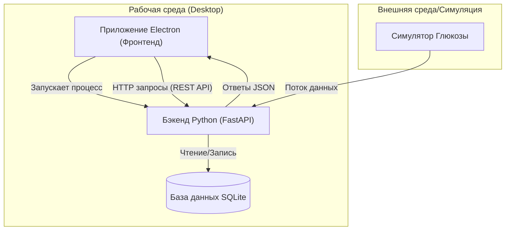
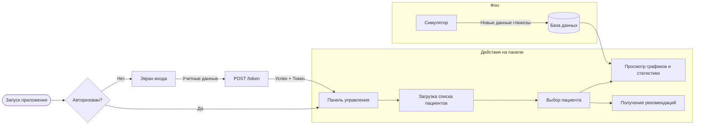
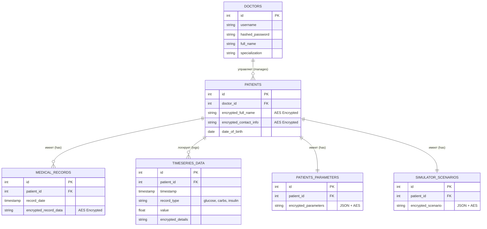
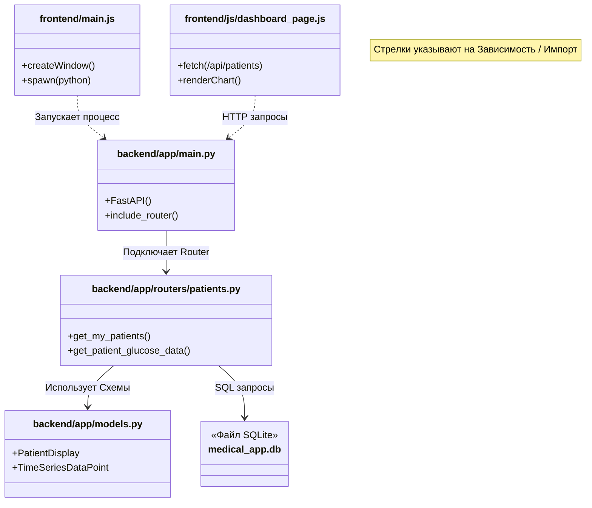
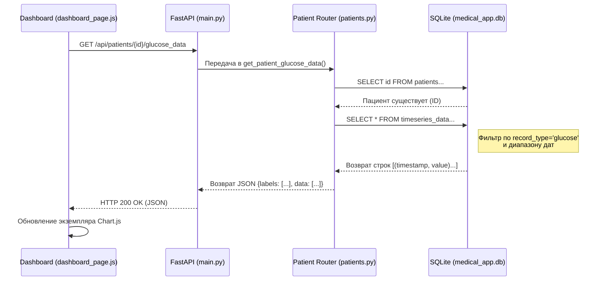

## 1. Технологический стек
- **Фронтенд (Frontend)**: Electron (Node.js) для оболочки рабочего стола, HTML/CSS/JS для пользовательского интерфейса.
- **Бэкенд (Backend)**: Python (FastAPI), работающий как локальный сервер для обработки логики, данных и взаимодействия с базой данных.
- **База данных**: SQLite для легковесного локального хранения данных.
- **Формат данных**: JSON для взаимодействия через API.

---

## 2. Архитектура системы

Приложение следует клиент-серверной архитектуре, где "сервер" работает локально на машине пользователя и управляется "клиентом" Electron.

### Поток взаимодействия
1. **Запуск**: При запуске приложения Electron (`main.js`), оно создает процесс Python как дочерний процесс.
2. **Рукопожатие**: Фронтенд ожидает сигнала готовности от бэкенда (через stdout "Uvicorn running").
3. **Взаимодействие**: Пользовательский интерфейс выполняет асинхронные запросы `fetch` к `http://127.0.0.1:8000`.
4. **Завершение работы**: Закрытие окна Electron убивает процесс Python для освобождения ресурсов.

---

## 3. Описание модулей

### Модули Бэкенда (Python)
Расположены в `backend/app/`:
- **`main.py`**: Точка входа. Настраивает API и подключает роутеры.
- **`models.py`**: Модели, определяющие структуры данных (например, `Patient`, `UserToken`).
- **`routers/`**:
    - **`auth.py`**: Обрабатывает вход пользователя и генерацию JWT токенов.
    - **`patients.py`**: Основная логика для списка, поиска и управления записями пациентов.
    - **`recommendations.py`**: Логика для анализа данных пациентов и генерации текстовых рекомендаций.
- **`analysis_utils.py`**: Вспомогательные функции для статистического анализа данных глюкозы.

### Компоненты Фронтенда (Electron/Web)
Расположены в `frontend/`:
- **`main.js`**: "Главный процесс" Electron. Обрабатывает создание окон, нативные меню и управление процессом бэкенда.
- **`html/`**:
    - `auth_page.html`: Экран авторизации.
    - `dashboard_page.html`: Основной интерфейс приложения.
- **`js/`**:
    - `dash_board.js`: отрисовка графиков (Chart.js) и проверка токенов.
- **`assets/`**: Иконки и стили.

---

## 4. Логика и Поток Данных

Следующая блок-схема иллюстрирует типичную сессию пользователя от входа в систему до анализа данных.

---

## 5. API и База Данных

Ключевые запросы включают:

- **Auth**: `POST /token` - Проверяет учетные данные и возвращает токен доступа.
- **Patients**:
  - `GET /patients/` - Получить всех пациентов (поддерживает фильтрацию).
  - `GET /patients/{id}` - Получить детальную информацию о конкретном пациенте.
- **Recommendations**: `POST /recommendations/analyze` - Анализировать предоставленные метрики.

#### Детали схемы базы данных

Приложение использует SQLite со следующей реляционной структурой. Ключевые поля данных (имена, контактная информация, клинические записи) шифруются при хранении.

#### Описание таблиц

1.  **`doctors`**: Хранит авторизованный медицинский персонал.
    *   `username`: Уникальный идентификатор для входа.
    *   `hashed_password`: Хэш пароля (Bcrypt).
    *   `is_active`: Механизм мягкого удаления.

2.  **`patients`**: Основные записи пациентов.
    *   **Шифрование**: `encrypted_full_name` и `encrypted_contact_info` обеспечивают безопасность персональных данных.
    *   `doctor_id`: Связывает пациента с его лечащим врачом.

3.  **`timeseries_data`**: Хранилище высокочастотных данных.
    *   Используется для хранения показаний глюкозы, болюсов инсулина и приема углеводов.
    *   `record_type`: Различает 'glucose' (глюкоза), 'insulin_bolus' (инсулин), 'carbs' (углеводы).
    *   `value`: Числовое значение показания/дозы.

4.  **`patients_parameters` & `simulator_scenarios`**:
    *   Хранят конфигурацию для симулятора.
    *   Данные хранятся как зашифрованные JSON-объекты, чтобы обеспечить гибкость изменения параметров без миграции схемы.

#### Заполнение данными (`seed_database.py`)
Система включает скрипт для заполнения базы данных тестовыми и демонстрационными данными:
*   Генерирует 5 синтетических пациентов используя `faker`.
*   Симулирует 30 дней непрерывного мониторинга глюкозы (CGM) (примерно 288 точек в день).
*   Симулирует реалистичные сценарии:
    *   **Прием пищи**: 3 раза в день (8:00, 13:00, 19:00) со случайным количеством углеводов.
    *   **Инсулин**: Расчетные дозы болюса на основе потребления углеводов.
    *   **Флуктуации**: Периодический случайный шум для имитации физиологической изменчивости.

---

## 6. Взаимодействие файлов и Поток Данных

Этот раздел детализирует, как различные модули кода взаимодействуют для выполнения запросов пользователя, от интерфейса до базы данных.

#### Зависимости модулей
Следующая диаграмма отображает отношения импорта и поток управления между ключевыми файлами.

#### Детальная последовательность данных: Получение данных глюкозы
Отслеживание потока данных, когда пользователь выбирает пациента и просматривает график глюкозы.

---

## 7. Обзор Интерфейса

### Аутентификация
Экран авторизации.

### Список пациентов 
Список пациентов и поиск среди них по ФИО и дате рождения.
- **Списки пациентов**:
  
  
  

### Реализация поведения панели
Панель можно свернуть и развернуть.

### Карточка пациента и общий вид приложения.

### Аналитика и визуализация
Реализация графиков за определенный промежуток времени и просмотр точек на графике (уровень глюкозы в крови, введенный инсулин и поступление углеводов)

### Медицинские рекомендации
Реализация анализа рекомендаций.

### Режим симуляции
На данный момент реализовано получение данных для симуляции каждого конкретного пациента.

