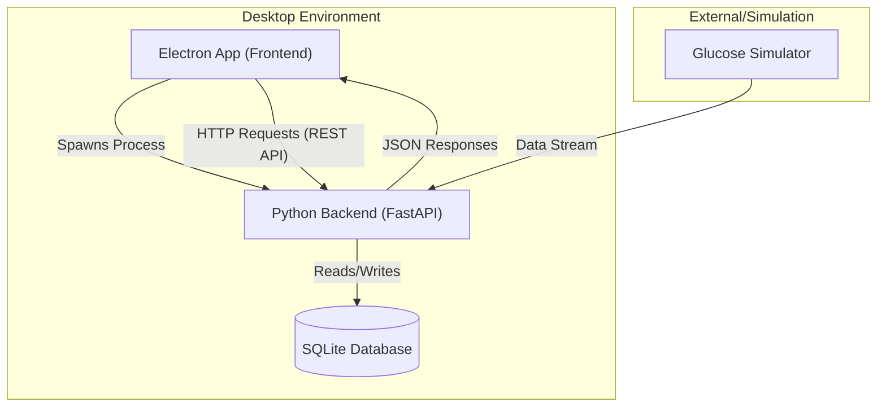
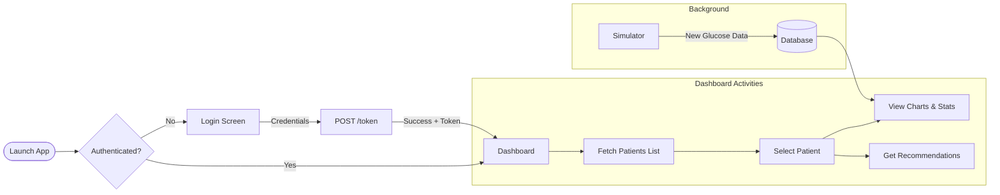
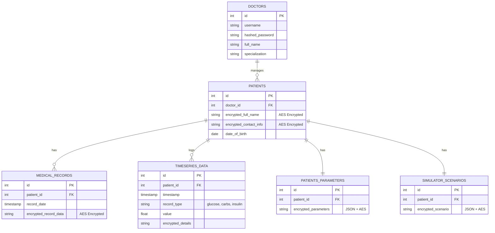

# Glukoze-Test Project Report

## 1. Introduction
**Glukoze-Test** is a comprehensive medical application designed for glucose monitoring and patient management. It provides a real-time dashboard for tracking patient metrics, visualizing glucose trends, and generating medical recommendations. The system is built as a desktop application ensuring data privacy and offline capabilities where necessary, while leveraging web technologies for a responsive user interface.

### Technology Stack
- **Frontend**: Electron (Node.js) for the desktop shell, HTML/CSS/JS for the UI.
- **Backend**: Python (FastAPI) running as a local server to handle logic, data processing, and database interactions.
- **Database**: SQLite (`medical_app.db`) for lightweight, local data storage.
- **Data format**: JSON for API communication.

---

## 2. System Architecture

The application follows a client-server architecture where the "server" runs locally on the user's machine, managed by the Electron "client".

### Communication Flow
1. **Startup**: When the Electron app launches (`main.js`), it spawns the Python backend as a child process.
2. **Handshake**: The frontend waits for the backend to signal readiness (via stdout "Uvicorn running").
3. **Interaction**: The UI makes asynchronous `fetch` requests to `http://127.0.0.1:8000`.
4. **Shutdown**: closing the Electron window kills the Python process to release resources.

---

## 3. Module Breakdown

### Backend Modules (Python)
Located in `backend/app/`:
- **`main.py`**: Entry point. Configures FastAPI, CORS, and includes routers.
- **`models.py`**: Pydantic models defining data structures (e.g., `Patient`, `UserToken`).
- **`routers/`**:
    - **`auth.py`**: Handles user login and JWT token generation.
    - **`patients.py`**: Core logic for listing, searching, and managing patient records.
    - **`recommendations.py`**: Logic for parsing patient data and generating text-based recommendations.
- **`analysis_utils.py`**: Helper functions for statistical analysis of glucose data.

### Frontend Components (Electron/Web)
Located in `frontend/`:
- **`main.js`**: The Electron "Main Process". Handles window creation, native menus, and backend process management.
- **`html/`**:
    - `auth_page.html`: Login screen.
    - `dashboard_page.html`: Main application interface.
- **`js/`**:
    - `dash_board.js`: interacting with the DOM, rendering charts (Chart.js or similar), and verifying tokens.
- **`assets/`**: Static resources like icons and styles.

---

## 4. Logic & Data Flow

The following flowchart illustrates the typical user session from login to data analysis.

---

## 5. API & Database

The backend exposes a RESTful API. Key endpoints include:

- **Auth**: `POST /token` - Validates credentials and returns an access token.
- **Patients**:
  - `GET /patients/` - Retrieve all patients (supports filtering).
  - `GET /patients/{id}` - Get detailed info for a specific patient.
- **Recommendations**: `POST /recommendations/analyze` - Analyze provided metrics and return advice.

#### Database Schema Details

The application uses SQLite (`medical_app.db`) with the following relational structure. key data fields (names, contact info, clinical notes) are encrypted at rest.

#### Table Descriptions

1.  **`doctors`**: Stores authorized medical personnel.
    *   `username`: Unique login identifier.
    *   `hashed_password`: Bcrypt hash of the password.
    *   `is_active`: Soft delete mechanism.

2.  **`patients`**: Core patient records.
    *   **Encryption**: `encrypted_full_name` and `encrypted_contact_info` ensure PII usage is secure.
    *   `doctor_id`: Links the patient to their attending physician.

3.  **`timeseries_data`**: High-frequency data storage.
    *   Used for storing glucose readings, insulin boluses, and carb intake.
    *   `record_type`: Distinguishes between 'glucose', 'insulin_bolus', 'carbs'.
    *   `value`: The numeric value of the reading/dose.

4.  **`patients_parameters` & `simulator_scenarios`**:
    *   Store configuration for the physiological simulation engine.
    *   Data is stored as encrypted JSON blobs to allow flexible parameter evolution without schema migrations.

#### Data Population (`seed_database.py`)
The system includes a seeding script to populate the database for testing and demonstration:
*   Generates 5 synthetic patients using `faker`.
*   Simulates 30 days of continuous glucose monitoring (CGM) data (approx. 288 points per day).
*   Simulates realistic scenarios:
    *   **Meals**: 3 times a day (8:00, 13:00, 19:00) with random carb counts.
    *   **Insulin**: Calculated bolus doses based on carb intake.
    *   **Fluctuations**: Periodic random noise to mimic physiological variability.

---

## 6. Interface Walkthrough

### Authentication
The entry point of the application ensures secure access.

### Dashboard & Patient Management
The main dashboard provides a holistic view of the patient population.
- **Patient Lists**:
  
  *(Alternative Views)*:
  
  

### Patient Analysis Panels
Detailed views for individual patient monitoring.

### Detailed Windows & Cards
Specific modules for deep-diving into patient metrics.

### Analytics & Visualizations
Comprehensive graphing capabilities to track glucose trends over time.

### Medical Recommendations
Automated analysis suggesting courses of action based on data patterns.

### Simulation Mode
Tools for simulating patient glucose levels for testing or predictive modeling.

