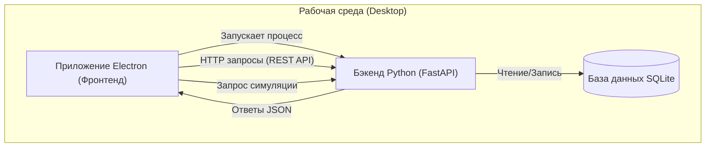
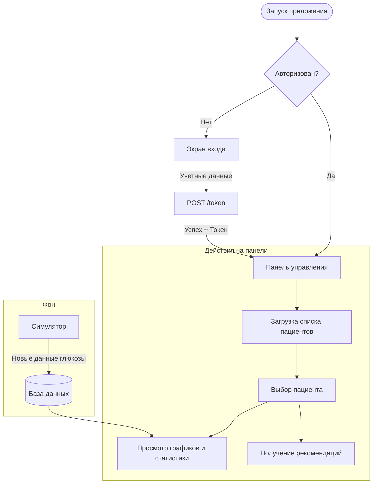

# Отчет о разработке приложения

## 1. Технологический стек

### 1.1 Фронтенд (Frontend)
Так как основным требованием, сформированным мной, было обеспечение полной кроссплатформенности, были отброшены такие инструменты создания интерфейса, как SwiftUI (используется в приложениях для устройств Apple), WinUI3 (используется только для приложений на устройствах под управлением Windows). Также был отброшен фреймворк Qt в силу отсутствия у меня опыта работы с ним.
Поэтому для обеспечения полной кроссплатформенности (MacOS, Windows, Linux, а при необходимости и Android) были выбраны **Electron (Node.js)** для создания приложения, **HTML/CSS/JavaScript** для формирования интерфейса. Немаловажным плюсом использования этих инструментов является наличие у меня опыта работы с ними, что позволило значительно ускорить разработку.

### 1.2 Бэкенд (Backend)
В силу того, что бэкенд приложения должен обеспечивать обработку большого количества данных и иметь большое количество дополнительных библиотек (для работы с текстом и соединения с базами данных) был выбран язык программирования **Python**. Возможными вариантами также были C++, Go и Rust, но они были отброшены, так как C++ имеет менее развитый набор дополнительных библиотек и более сложный синтаксис, а для работы с Go и Rust у меня недостаточно опыта для написания необходимого приложения.

### 1.3 База данных
Для хранения данных можно было использовать PostgreSQL, MicrosoftSQL, MySQL, но я решил остановиться на **SQLite**, так как SQLite не требует установки отдельного сервера базы данных в системе, создания пользователей и сложного администрирования. Также преимущество этой СУБД (системой управления базами данных) заключается в легковесности (вся база данных это один файл), малом потреблении системных ресурсов, что позволяет снизить системные требования для аппаратной части сервера. Несмотря на это, SQLite также является полностью ACID-совместимой (**ACID** – Atomicity, Consistency, Isolation, Durability), что обеспечивает надежность хранения, передачи и записи данных даже при сбоях питания или попытках “сломать” базу данных.

#### 1.3.1 Пояснение про ACID

Транзакция – операция с базой данных. Аббревиатура расшифровывается так:

1.  **Atomicity — Атомарность («Все или ничего»)**
    Транзакция выполняется как единое неделимое действие. Если внутри транзакции должно произойти пять изменений, и на четвертом случилась ошибка — отменяются все пять. Система возвращается в состояние, которое было до начала транзакции.
    *Пример: Вы переводите деньги с одного счета на другой. Сначала деньги списываются у вас, потом зачисляются другу. Если после списания связь оборвалась, атомарность гарантирует, что деньги вернутся вам, а не «растворятся в воздухе».*

2.  **Consistency — Согласованность**
    Транзакция должна переводить базу данных из одного стабильного состояния в другое. Это значит, что все правила базы (ограничения, ключи, связи) не должны нарушаться.
    *Пример: Если в базе настроено правило, что баланс кошелька не может быть отрицательным, СУБД просто не даст завершить транзакцию, которая попытается списать больше денег, чем есть на счету.*

3.  **Isolation — Изолированность**
    Транзакции, запущенные одновременно, не должны влиять друг на друга. Результат выполнения нескольких параллельных транзакций должен быть таким же, как если бы они выполнялись строго по очереди.
    *Пример: Если два человека одновременно пытаются купить последний билет на самолет, изолированность гарантирует, что билет достанется только одному, а второй получит сообщение «билетов нет», так как транзакции не перемешаются.*

4.  **Durability — Стойкость (Долговечность)**
    Если пользователь получил подтверждение, что транзакция завершена, он может быть уверен: данные записаны «намертво». Даже если через секунду сервер полностью обесточится, после перезагрузки данные будут на месте.
    *Как это работает: СУБД обычно сначала записывает изменения в специальный журнал транзакций (Journal или WAL-файл в SQLite) на жесткий диск, а уже потом обновляет основную базу.*

### 1.4 Формат данных
Для взаимодействия Бэкенда и Фронтенда в большинстве проектов используется или XML или JSON. Выбор для фронтенда языка программирования JavaScript определил и выбор **JSON** как формата передачи данных (JSON расшифровывается как JavaScript Object Notation (объектная нотация JavaScript)).

## 2. Архитектура системы

Архитектура “клиент – сервер” была выбрана в силу того, что она обеспечивает возможность масштабирования (можно увеличить число клиентов и при этом не увеличивать число серверов). Также такая архитектура упрощает отладку, так как сервер можно запустить локально и воспроизвести полноценную среду, в которой будет работать программа.

Также применение такой архитектуры обеспечивает разделение интерфейса пользователя и вычислительной части приложения (интерфейс работает отдельно, сервер для хранения и работы с данными - отдельно). Описанные преимущества обеспечили выбор именно такой архитектуры, а не монолитной (когда все работает в одном исполнительном модуле) или микросервисной (каждая функция является отдельным модулем).

Порядок работы приложения имеет следующий вид:

2.1. При запуске интерфейса пользователя (Приложение Electron) также запускается процесс Python (Бэкенд) – сейчас так сделано для тестирования, в реальной работе сервер работает независимо на другом устройстве.
2.2. Пользовательский интерфейс выполняет асинхронные запросы к бэкенду для авторизации, просмотра графиков, получения списков пациентов и так далее.
2.3. Закрытие приложения Electron закрывает также процесс Python – сейчас так сделано для отладки, при реальной эксплуатации сервер работает даже при закрытии интерфейса.

### Поток данных и логика работы

Ниже представлена диаграмма, иллюстрирующая типичную сессию пользователя:

## 3. Реализация модулей приложения

Весь код, отвечающий за «интеллект» приложения, расположен в директории `backend/app/`. Мной было принято решение разбить монолитный файл на несколько логических блоков (роутеров), так как это упрощает навигацию по коду и его дальнейшую поддержку.

3.1. `main.py` - В нем инициализируется экземпляр приложения FastAPI.
Мной был настроен `CORSMiddleware` (Cross-Origin Resource Sharing), так как без этой настройки браузерный движок Electron блокировал бы запросы к локальному серверу по соображениям безопасности. Здесь же происходит подключение (include) всех остальных роутеров, что собирает разрозненные модули в единое рабочее приложение.

3.2. `models.py` - В этом файле описаны модели данных. Использование строгой типизации (библиотека Pydantic для валидации данных) позволяет избежать ошибок, связанных с некорректным форматом данных, поступающих от фронтенда или базы данных.

3.3. `auth_utils.py` – в этом файле задается конфигурация безопасности: считываются ключи доступа из .env файла (переменные окружения), кодируются и декодируются JWT-токены.

3.4. `encryption_utils.py` – так как в приложении идет работа с медицинскими данными, то было принято решение производить их полное шифрование в базе данных. Для этого используются ключи шифрования из файла .env, библиотеки cryptography и beecrypt.

3.5. `recommendation_parser.py` – файл с логикой анализа текстовых рекомендаций. Сейчас используется логика на основе шаблонов, также существует альтернатива в виде применения анализа на основе нейросетей. Используется библиотека spacy и модель сравнения “ru_core_news_sm”. Подробнее в пункте 4.

3.6. `routers/` - Папка с модулями маршрутизации:
*   `auth.py` — Логика работы файла построена следующим образом: Приложение получает от пользователя логин и пароль. Происходит сравнение введенного пароля с хешем в базе данных. В случае успеха функция `create_access_token` генерирует JWT-токен, который подписывается секретным ключом (SECRET_KEY). Этот токен возвращается на фронтенд и сохраняется там для подтверждения авторизации в дальнейших запросах.
*   `patients.py` - Основной модуль управления. Он содержит функции для создания, чтения и поиска карт пациентов в базе данных.
*   `recommendations.py` – проверяет результаты парсинга рекомендаций, в случае проблем возвращает ошибку.

3.9. `analysis_utils.py` - Файл с вспомогательными математическими функциями для статистического анализа временных рядов. (Сейчас не используется, оставлен как возможность для дальнейшего улучшения возможностей приложения).

3.10. `data_ingest.py` – служит для приема данных от внешних устройств (оставлен как заготовка для дальнейшего развития приложения, но работает уже сейчас).

3.11. `__init__.py` – служебный файл, созданный системой.

3.12. `medical_app.db` – файл базы данных с пациентами.

#### Схема базы данных

Реализованная структура базы данных, обеспечивающая связи между врачами, пациентами и их медицинскими показателями:

3.13. Остальные файлы являются чисто служебными, поэтому здесь не описаны.

3.14. Компоненты Фронтенда (Frontend). Расположены в директории `frontend/` и отвечают за то, что видит пользователь.

3.15. `main.js` - Главный процесс Electron. Он отвечает за создание окон, нативные меню и управление процессом бэкенда.

3.16. `html/` и `js/` - Содержат верстку страниц (`dashboard_page.html`, `auth_page.html`) и скрипты отрисовки графиков. Для визуализации данных была выбрана библиотека **Chart.js**, так как она позволяет строить интерактивные графики с высокой производительностью, в отличие от более тяжелых аналогов. `css/` содержит в себе файлы стилей, которые применяются к страницам `html/`.

## 4. Алгоритм анализа медицинских рекомендаций

Ключевая особенность системы заключается в возможности автоматической обработки текстовых назначений врача, что позволяет исключить ошибки ручного ввода данных. Для реализации этого функционала в файле `backend/app/recommendation_parser.py` была выбрана гибридная стратегия обработки естественного языка (NLP).

### 4.1 Выбор инструментария

Мной рассматривались три подхода к решению задачи извлечения данных из текста:
*   **Регулярные выражения (RegEx)**: Были отброшены, так как они слишком жесткие и не могут корректно обрабатывать вариативность языка (например, синонимы "уменьшить", "снизить", "срезать" требовали бы написания десятков правил).
*   **Большие языковые модели (LLM)**: Использование нейросетей типа BERT или GPT было отклонено по причине их требовательности к ресурсам. Врачебное приложение должно работать быстро на обычном офисном ноутбуке без видеокарты, а загрузка тяжелых моделей сделала бы приложение "неподъемным".
*   **Библиотека spaCy с правилами Matcher**: Этот вариант был выбран как оптимальный. SpaCy позволяет использовать лингвистические характеристики слов (лемматизацию, части речи), оставаясь при этом крайне быстродействующей и работающей локально на CPU. Используемая модель `ru_core_news_sm` занимает всего несколько десятков мегабайт.

### 4.2 Лемматизация

Одной из главных проблем парсинга является склонение слов в русском языке. Для решения этого используется процесс лемматизации — приведение слова к его начальной форме. Например, благодаря spaCy, слова "снизить", "снизил", "снизьте" будут автоматически приведены к одной лемме — "снизить". Это позволяет написать одно правило, которое покроет все варианты написания, что значительно упрощает разработку.

### 4.3 Логика работы парсера

Анализ текста разделен на два независимых этапа для повышения точности (Separation of Concerns):
1.  **Поиск контекста времени**: Сначала алгоритм сканирует текст на наличие временных интервалов (например, "с 22:00 до 07:00"). Если интервал найден, он нормализуется (например, "23.00" автоматически превращается в "23:00") и сохраняется как контекст для следующего шага.
2.  **Поиск действий**: Далее алгоритм ищет конкретные медицинские назначения.
    *   *Изменение базы*: Поиск паттернов вида `[Глагол изменения] + [Существительное "база"] + [Число] + [%]`. Система автоматически определяет знак изменения (минус для "снизить", плюс для "повысить").
    *   *Изменение углеводного коэффициента (УК)*: Поиск паттернов привязки к приему пищи (например, "УК на завтрак 1.5").

## 5. Безопасность и защита данных

Поскольку приложение работает с чувствительными медицинскими данными (PHI - Protected Health Information), вопросы безопасности были приоритетными при проектировании архитектуры.

### 5.1 Шифрование данных (Encryption at Rest)
Все персональные данные в базе данных SQLite хранятся в зашифрованном виде. Для реализации использован алгоритм симметричного шифрования Fernet (на основе AES-128), реализованный в библиотеке `cryptography`. Это гарантирует, что даже если файл базы данных `medical_app.db` будет похищен с компьютера врача, злоумышленник увидит лишь бессвязный набор символов вместо имен и диагнозов пациентов. Ключи шифрования хранятся отдельно в переменных окружения (`.env`), что соответствует лучшим практикам безопасности.

### 5.2 Хеширование паролей
Пароли врачей никогда не хранятся в открытом виде. При регистрации пароль преобразуется в необратимый хеш с использованием библиотеки `passlib` (алгоритм bcrypt). Это делает невозможным восстановление пароля даже при полном доступе к базе данных.

### 5.3 JWT Авторизация (Stateless Authentication)
Для управления сессиями используется стандарт JSON Web Tokens (JWT). Это позволяет серверу не хранить состояние сессии в памяти (Stateless), что упрощает масштабирование. Токен подписывается секретным ключом на сервере, что исключает возможность его подделки злоумышленником.

## 6. Дизайн и Интерфейс Приложения

При разработке пользовательского интерфейса (UI) основной упор был сделан на чистоту, контрастность и информативность, так как приложение предназначено для длительной работы медицинского персонала с большим объемом данных.

### Концепция дизайна
Был выбран **темный режим** оформления ("Dark Mode") как основной. Это решение обосновано снижением нагрузки на глаза врача при работе в условиях искусственного освещения кабинета, а также обеспечением лучшей читаемости цветных графиков (синий и красный цвета на черном фоне воспринимаются четче, см. `images/График_1.png`).

1.  **Карточка пациента и навигация**
    Интерфейс разделен на функциональные зоны. Слева расположена свертываемая боковая панель навигации (`images/Панель_1.png`), что позволяет освободить максимум пространства для работы с графиками (`images/Панель_2.png`). Карточка пациента (`images/Карточка_1.png`) выносит ключевую информацию (возраст, вес, тип терапии) в "шапку", чтобы она всегда была перед глазами.

2.  **Визуализация данных**
    Для отображения динамики глюкозы используются комбинированные графики Chart.js.
    *   **Линейные графики** показывают тренды уровня сахара.
    *   **Точечные диаграммы** (Scatter plot) отмечают события: начало инъекции инсулина или прием пищи.
    *   Цветовое кодирование: Красные зоны на графиках (см. `images/График_3.png`) интуитивно сигнализируют о выходе показателей за пределы нормы (гипергликемия или гипогликемия).

3.  **Модальные окна и формы**
    Всплывающие окна (например, окно авторизации `images/Авторизация.png` или настроек симуляции `images/Симулятор_2.png`) центрированы и затемняют фон, фокусируя внимание пользователя выполняемой задаче. Формы ввода рекомендаций (`images/Рекомендации.png`) имеют минималистичный дизайн, не перегруженный лишними элементами, чтобы ускорить процесс заполнения.

4.  **Адаптивность списков**
    Списки пациентов (`images/Список_1.png`) реализованы в виде плит, что упрощает визуальное сканирование имен и статусов по сравнению с традиционными таблицами.

## 7. Заключение

Разработанное программное обеспечение представляет собой сбалансированное решение, сочетающее современные веб-технологии (Electron, Chart.js) для удобного интерфейса и мощные инструменты анализа данных (Python, Pandas, Spacy) на бэкенде. Модульная архитектура позволяет в будущем легко расширять функционал, например, добавляя новые модули прогнозирования на основе нейросетей, не переписывая основное ядро программы. Выбранный стек технологий полностью отвечает требованиям кроссплатформенности, безопасности и автономности работы.
